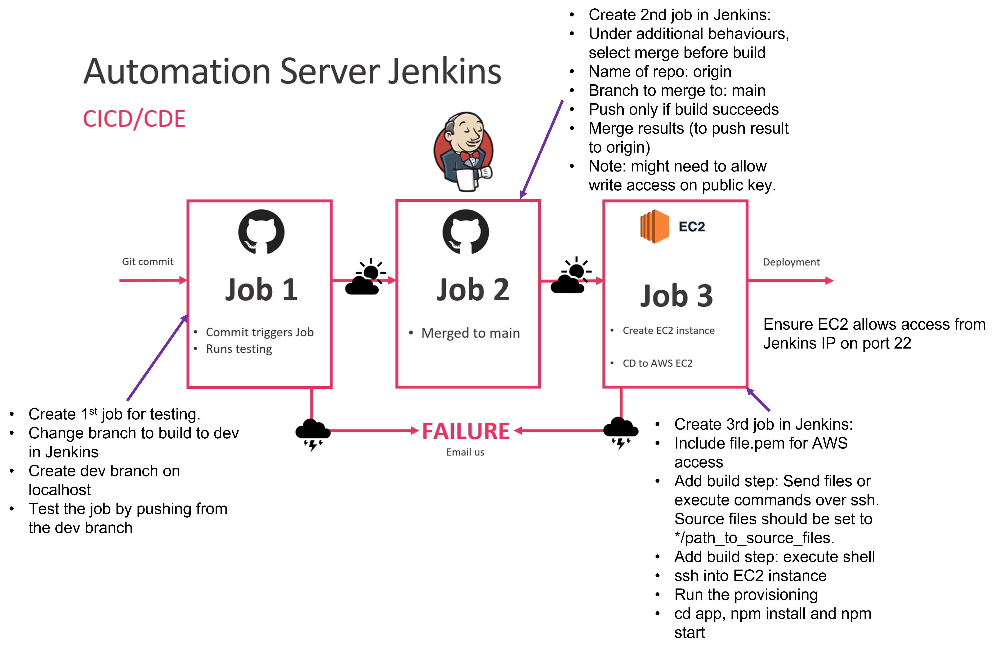

# CICD Pipeline

Before starting this documentation, create a Jenkins server as shown in the [Jenkins Set-up Documentation](../documentation/Creating_Jenkins_Server.md).

# Overview of CICD Pipeline

# Building the Pipeline

# Deploying the app

When setting up Jenkins to set up app in EC2, execute a shell script for the build:
- `scp -r app_code/ ubuntu@ec2_instance_IP:` - you can find the relevant IP from ssh command under SSH client tab for EC2 instance.
- ssh in using `ssh -A -o "StrictHostKeyChecking=no" ubuntu@ec2-3-250-215-66.eu-west-1.compute.amazonaws.com << EOF`
- Run the usual dependencies, or use the provisioning file included: `cd app_code/environment/app/` -> `sudo chmod +x provision.sh` -> `sudo ./provision.sh`
- `cd ~/app_code/app/`
- install npm using `sudo apt-get install npm -y` -> `npm install`
- Start the app using `nohup node app.js > /dev/null 2>&1 &`
- On the next line, run `EOF` (these are important to allow the terminal to leave).