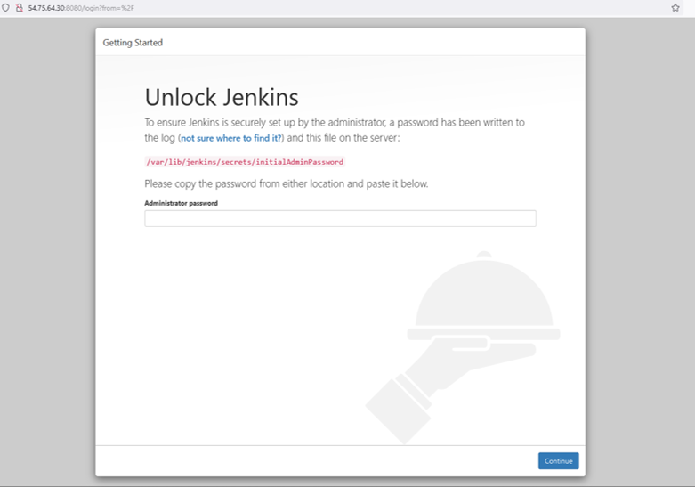
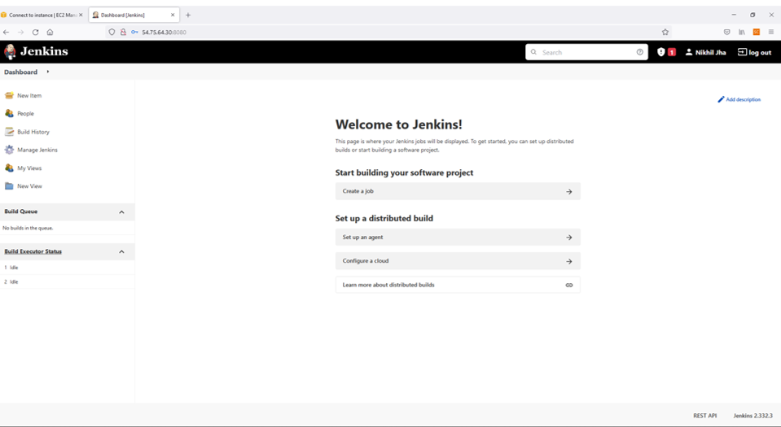
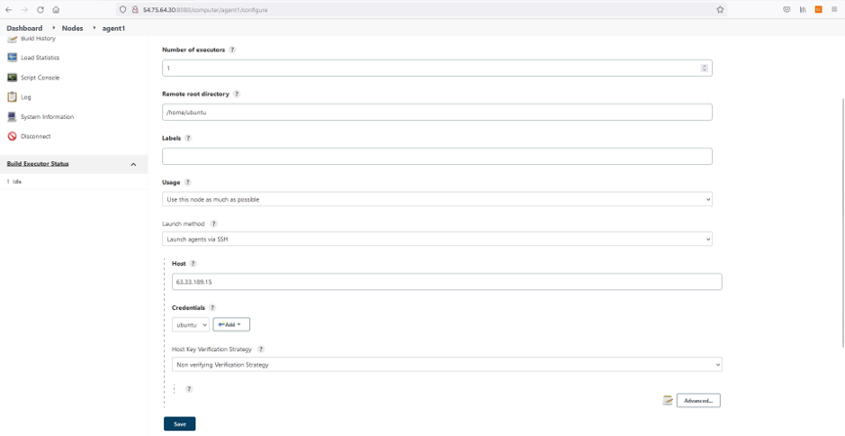

# Creating a Jenkins Server on AWS
These instructions assume familarity with AWS EC2 instances.
- Spin up two EC2 instances - one of these will be the controller, and the other the agent node. Attributes:
  - Ubuntu 18.04
  - T2 Micro
  - Default volume of 8 GiB
  - Tag Name as appropriate
  - Security group: allow ssh port 22 for your ip; allow http port 80 and jenkins port 8080 from anywhere.
- ssh into the controller and install Jenkins:
  - `sudo apt-get update` and `upgrade -y`
  - `curl -fsSL https://pkg.jenkins.io/debian-stable/jenkins.io.key | sudo tee /usr/share/keyrings/jenkins-keyring.asc > /dev/null`
  - `echo deb [signed-by=/usr/share/keyrings/jenkins-keyring.asc] https://pkg.jenkins.io/debian-stable binary/ | sudo tee /etc/apt/sources.list.d/jenkins.list > /dev/null`
  - `sudo apt-get update -y` - ensures packages are loaded.
  - `sudo apt-get install fontconfig openjdk-11-jre -y` (Java is required for Jenkins to run).
  - `sudo apt-get install jenkins -y`
  - `sudo systemctl enable jenkins`
  - `sudo systemctl start jenkins`
  - `sudo systemctl status jenkins`

- Head to the controller public DNS and use port 8080. You should then see the Unlock Jenkins page, where you will need to enter an initial Admin password:

- Within the controller, use `sudo cat /var/lib/jenkins/secrets/initialAdminPassword` to view the password - it won't let you enter the folder directly.
- Once you've copied and entered the password, install suggested plug-ins and set up the first Admin User.
- Congratulations! The Jenkins interface should now be running.

## Creating the agent node
It isn't best practice to build on the controller - so we will create an agent node. 

Now we will create the agent node.
- First, add a new ssh rule to the security group to allow ssh access from the Jenkins controller public ip (DO NOT include :8080) (a slash 32 will automatically be added).
- ssh into the agent instance, `update` and `upgrade`, and then `sudo apt-get install default-jre -y`
- Return to the Jenkins interface.
- Navigate to __Manage Jenkins > Manage nodes and clouds > New Node__
- Name this `agent1`, and select `Make Permanent Agent`.
- Then fill out the form:
  - __Number of executors__: 1
  - __Remote root directory__: /home/ubuntu
  - __Useage__: Use this node as much as possible.
  - __Launch Method__: Launch agents via ssh:
    - __Host__: Public IP address of agent instance.
    - __Credentials__: ubuntu
    - __Host Key Verification Strategy__: Non veriying Verification Strategy. (Obviously, this is a low level of security - please be aware of this when using Jenkins in a commercial setting).
  - __Availability__: Keep this agent online as much as possible.

- `Save` this node.
- You should have now successfully configured an agent node! When creating a new build, select `Restrict where this build can be run` and search for agent1.
- To test, you make a project that executes the shell script `uname -a`.

Then we instruct Jenkins on how to access AWS.
- On the Jenkins interface, navigate to **Mangange Jenkins** > __Manage Plugins.__
- Switch to the `Available` tab, and search for Amazon EC2, select and then install the plug-in without restart.
- Return to the dashboard, and select __Configure a cloud__.
- Add a new cloud, selecting Amazon EC2.
- In the form that appears:
  - __Name__: your name
  - __Amazon EC2 Credentials__: add these and select.
  - __region__: select as appropriate.
  - Add the __EC2 Key Pair's Private Key__, and set the __Username__ to `ubuntu` - this is important, as otherwise when you create the agent it will fail.
- `Apply` and then `Save` this cloud.
